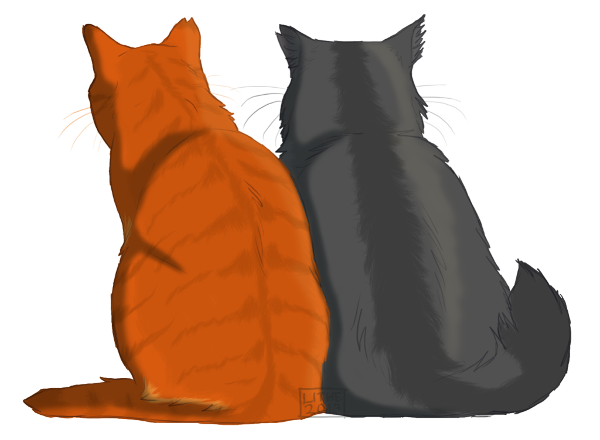

## [St. Louis Lambert International Airport (STL)](https://www.flystl.com/)
10701 Lambert International Blvd, St. Louis, MO 63145

The St. Louis Airport is approximately 111 miles (or 1 hour and 42 minutes) from the wedding venue. While there is a shuttle service to and from Columbia for a reasonable fare, we recommend [renting a car](https://www.flystl.com/parking-and-transport/rental-cars) for your convenience. 

 

 

## [Kansas City International Airport (MCI)](http://www.flykci.com/)
Kansas City, MO 64153

The Kansas City airport is approximately 146 miles (or 2 hours and 12 minutes) from the wedding venue. While there is shuttle service to and from Columbia for a reasonable fare, we recommend [renting a car](http://www.flykci.com/getting-to-from/ground-transportation/rental-car-services/) for your convenience. 

 

 

## [Columbia Regional Airport (COU)](https://www.flycou.com/)
- Address: 11300 S Airport Dr, Columbia, MO 65201

The Columbia Airport is 13 miles (or 19 minutes) from the wedding
venue. A little more expensive, but much closer to the wedding
venue--though you may still want a [rental car](https://www.flycou.com/?page_id=98) or [taxi](https://www.flycou.com/?page_id=98). Columbia Regional Airport is served by American Airlines and United Airlines providing reliable and convenient direct, non-stop flights from Columbia to Dallas/Fort Worth, Chicago O'Hare and Denver International Airports!

 

 

## [MOX Airport Shuttle (St. Louis and Kansas City)](http://moexpress.com/moxolrs/Pricing.aspx)
Approximately $108 round trip

## [EZGO Bus (only to St. Louis)](http://www.ezgobusmo.com/book-your-ride/)
Approximately $80 round trip

 

 
