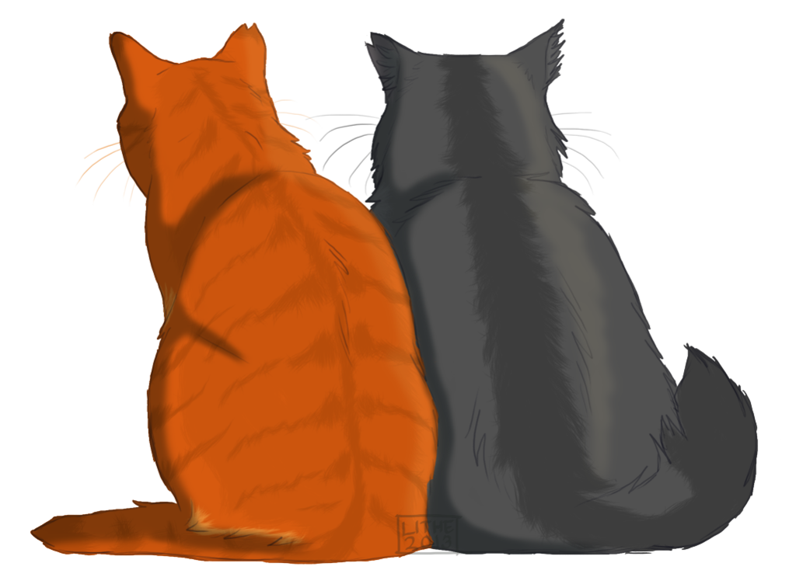

<stle>
.page-header {
background-image: url(img/header2.jpeg) !important;
}
h1, h2, h3, h4, p, ul li, ul {
text-align: center;
color: #555;
}
h1.project-name {
font-size: 2.5em;
margin-top: 10px;
padding-top: 20px;
color: white;
}
h4.author.project-author a {
color: #f3f3f3;
font-size: 1.35em;
}
.main-content h3 {
color: black;
}
ul {
list-style-type: none;
}
p {
max-width: 500px;
margin-left: auto;
margin-right: auto;
}
ul li {
margin-left: -2px;
padding: 5px;
}
html, body {
font-family: Georgia;
}
</style>

## [Glenn’s Café](http://www.glennscafe.com/)
Address: 29 S 8th St, Columbia, MO 65201

Located in the Tiger Hotel, “familiar Cajun-Creole & American dishes are the draw at this local eatery with a relaxed atmosphere.” We love their Jambalaya!

## [Flat Branch Pub & Brewing](https://www.flatbranch.com/)
Address: 115 S 5th St, Columbia, MO 65201

4-minute walk, this very popular destination is a “warehouse setting for house-brewed beer, a big selection of whiskey & upscale American pub fare.” REALLY good beer ☺

## [Addison’s: An American Grill](http://www.addisonsgrill.com/)
Address: 709 Cherry St, Columbia, MO 65201

A 1-minute walk from the tiger hotel, Addison’s is a “convivial eatery, decorated in colorful paintings, boasts an eclectic menu & a happy hour.”

## [Shakespeare’s Pizza](https://shakespeares.com/)
Address: 225 S 9th St, Columbia, MO 65201

A 4-minute walk from the Tiger Hotel, “this old-school popular pizza joint serves up traditional hand-tossed pies in a laid-back homey setting.” In our opinion, the pizza is best if you eat it there!

## [Sparky’s Homemade Ice Cream](https://www.facebook.com/sparkyshomemade/)
Address: S 9th St, Columbia, MO 65201

If you are looking to stroll for dessert, Sparky’s is a 2-minute walk from the Tiger Hotel to a “Cozy shop serving housemade ice cream in a casual space with eclectic art on the walls.” Mike highly recommends the cinnamon ice cream, Casi prefers a classic chocolate!

## [Kaldi’s Coffee](https://kaldiscoffee.com/)
Address: 29 S 9th St #1, Columbia, MO 65201

If you want to get a little local coffee, we love Kaldi’s. It’s a 2-minute walk from the Tiger Hotel and they are a “chill coffeehouse specializing in coffee & espresso drinks made from carefully sourced beans.” Highly recommend the vanilla latte!

 

 

